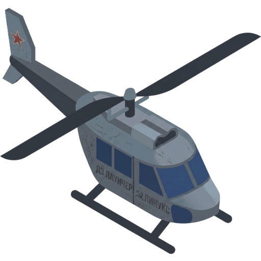
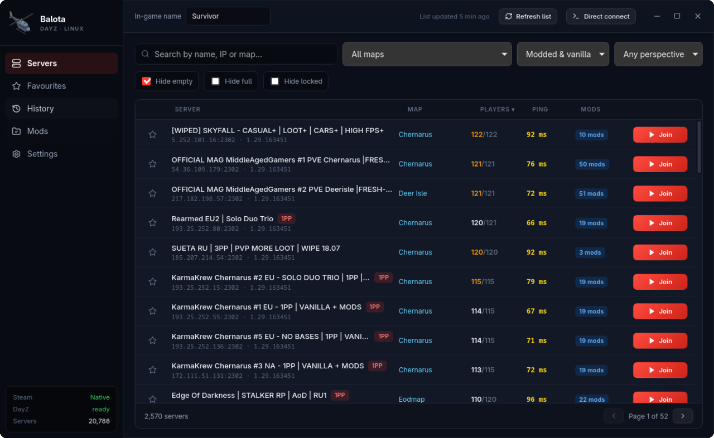
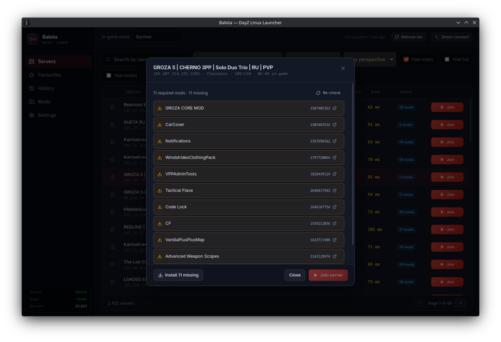

<p align="center">
  
</p>

<h1 align="center">Balota</h1>

<p align="center"><strong>DayZ server browser and mod manager for Linux and the Steam Deck.</strong></p>

DZSA Launcher — the tool everyone uses to find modded DayZ servers — is Windows only.
Balota does that job natively on Linux: it lists every DayZ server, resolves the mods
each one requires, tells you which ones you are missing, and launches the game through
Steam with the symlinks Proton needs to load them.



## What it does

- **Every server, in one request.** ~21,000 servers pulled from the DZSA master list,
  filtered and paginated natively so typing in the search box never stutters.
- **Real latency.** Direct A2S/UDP probes of the servers on screen, including the
  challenge handshake servers have required since 2020.
- **Mods per server.** Each server's mod list with names and Workshop IDs, and a clear
  mark on the ones you do not have. Joining is blocked until they are installed, instead
  of launching you into a rejection.
- **Symlinks that work under Proton.** Mods are linked as `@<base64>` inside the DayZ
  folder, using the compact encoding that keeps the `-mod=` command line under its
  length limit and free of characters Wine mangles.
- **Finds DayZ wherever it lives.** Reads `libraryfolders.vdf`, so a second drive or the
  Steam Deck's SD card is covered, and `appmanifest_221100.acf`, so a renamed install
  folder still works. Native, Flatpak and Snap Steam.
- **Mod housekeeping.** The Mods tab lists what is installed and unsubscribes in bulk,
  which is how mods actually leave the system — Steam deletes the files and stops
  tracking them.
- Favourites, join history, and filters by map, mods, perspective, occupancy and
  password.



## Install

No packages yet — build from source.

**Dependencies**

| Distro | Command |
| --- | --- |
| Arch, CachyOS, EndeavourOS | `sudo pacman -S --needed webkit2gtk-4.1 gtk3 base-devel curl wget file` |
| Debian, Ubuntu, Mint, Pop!_OS | `sudo apt install libwebkit2gtk-4.1-dev libgtk-3-dev build-essential curl wget file libssl-dev librsvg2-dev` |
| Fedora, Nobara | `sudo dnf install webkit2gtk4.1-devel gtk3-devel openssl-devel gcc-c++ librsvg2-devel` |
| Bazzite, SteamOS, Silverblue | see below — these are immutable |

Plus [Rust](https://rustup.rs) 1.77+ and Node.js 18+.

**Build**

```bash
git clone https://github.com/ayozetr/balota.git
cd balota
npm install
npm run app          # run it
npm run app:build    # AppImage + .deb in src-tauri/target/release/bundle/
```

The release binary is ~5 MB; the AppImage carries its own GTK/WebKit payload and needs
no runtime dependencies.

### Immutable distros (Bazzite, SteamOS, Silverblue)

The system image is read-only, so build dependencies do not belong on the host. Use the
AppImage if you just want to run Balota — it bundles everything and needs nothing
installed.

To build it yourself, do it inside a container (`distrobox` ships with Bazzite and
SteamOS):

```bash
distrobox create --name balota --image fedora:41
distrobox enter balota
sudo dnf install webkit2gtk4.1-devel gtk3-devel openssl-devel gcc-c++ librsvg2-devel \
  nodejs npm git
# then the normal build; the resulting AppImage runs on the host
```

Do not reach for `rpm-ostree install` for this: it layers development packages onto
every future system update for no reason, and needs a reboot each time.

## Using it

1. Pick a server. Clicking one queries it live and lists its mods.
2. **Subscribe & install** subscribes to the whole list at once, so Steam downloads the
   mods and keeps them updated from then on. Progress updates on its own.
3. **Join server** creates the symlinks and launches DayZ through Steam.

Steam has to be running (Balota starts it otherwise; with the Flatpak build, start it
yourself first).

## Deliberate limitations

- **Subscribing identifies Balota as DayZ.** Subscribing goes through the Steamworks
  SDK, which means announcing AppID 221100 to Steam — so Steam shows you as playing DayZ
  for the few seconds the helper runs. It is confined to a separate short-lived process
  for exactly that reason. If Steam is closed, Balota falls back to downloading the mods
  unsubscribed and says so.
- **GameMode and MangoHud are not toggles.** They cannot work from here.
  `steam -applaunch` only hands a request to the running Steam client, which spawns the
  game itself — wrapping that command wraps nothing. Settings shows the string to paste
  into Steam's own launch options, which is the one place that does work.
- **No gamepad navigation yet**, so Steam Deck Game Mode is usable but not comfortable.

## Troubleshooting

**Blank window, or `Gdk-Message: Error 71 dispatching to Wayland display`.**
WebKitGTK's DMABUF renderer misbehaving on Wayland. Balota already sets
`WEBKIT_DISABLE_DMABUF_RENDERER=1` on itself at startup, so this should not happen — if
it still does, fall back to XWayland:

```bash
GDK_BACKEND=x11 balota
```

**DayZ not found.** Settings lists every path that was searched. If your install lives
somewhere unusual, set the Steam path by hand there — it wants the folder that contains
`steamapps`.

**Joining does nothing.** Steam has to be running, and with the Flatpak build it must be
started before Balota. Settings shows whether Balota can see it.

## How it works

The Proton mod-loading dance, the DZSA endpoints and the A2S challenge are written up in
[docs/HOW-IT-WORKS.md](docs/HOW-IT-WORKS.md). Development setup lives in
[CONTRIBUTING.md](CONTRIBUTING.md).

## Credits

Server data comes from the public [dayzsalauncher.com](https://dayzsalauncher.com) API.

## Legal

Balota is an unofficial tool built by the community. It is not affiliated with,
authorised by or endorsed by Bohemia Interactive a.s., Valve Corporation or DZSA
Launcher.

Bohemia Interactive, ARMA, DayZ and all associated logos and designs are trademarks or
registered trademarks of Bohemia Interactive a.s. Steam and the Steam logo are
trademarks of Valve Corporation. All other trademarks are the property of their
respective owners.

## License

GNU General Public License v3.0 or later, with an additional permission under section 7
for linking against the Steamworks SDK — see [LICENSE](LICENSE). Copyright © 2026 Ayoze
Torres.

In short: the source stays open. Anyone may use, study, modify and redistribute Balota,
and any distributed derivative has to ship its source under the same terms. The extra
permission exists so the app can talk to Steam through Valve's proprietary SDK, which
the GPL alone would not allow.

Third-party dependencies and their licences are listed in
[docs/THIRD-PARTY.md](docs/THIRD-PARTY.md).

---

<p align="center">
  Built by <a href="https://github.com/ayozetr">@ayozetr</a> ·
  <a href="https://ko-fi.com/ayozetr">Support on Ko-fi</a>
</p>
